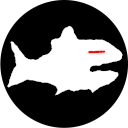

# idletank

Chrome extension offering quality of life updates to fishtank.live with a focus on dedicated 24/7 streaming devices. The goal of this extension is to eliminate any form of user interaction by automatically closing modals, auto switching to director cam, etc. so I can avoid having to plug in a mouse to my Raspberry Pi every time a modal gets pushed out or the director cam gets out of sync.

## Features
These settings can all be toggled in the options for the Chrome extension.

- auto close modals
- auto close toasts
- always force director cam
- always force full screen

